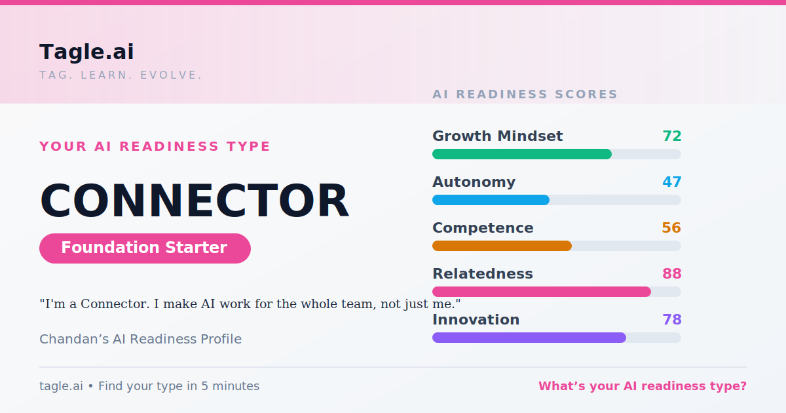

# Tagle.ai "Tag" summary

Phase 1 of the Graduate Vibe Coding Challenge (Mindset & Culture Alignment). Values below are taken from the saved
Tagle quiz-result page (`tagle.ai/quiz/result`) and cross-checked against the Tagle share card
([tagle-tag.png](tagle-tag.png)).

| | |
|---|---|
| **AI Readiness Type (Tag)** | **The Connector**, with a Pioneer edge |
| **Readiness tier** (result page) | Developing (average of the five dimensions = 68) |
| **Journey stage** (result page) | Foundation Practitioner — "Foundation mindset · Mid skills" |
| **Share-card label** | "Foundation Starter" |
| **Tagline** | "You bring people together to make AI work for everyone" |
| **Source** | 5-minute Initial Quiz (a directional projection; the full conversational assessment may refine it) |

> The share card and the result page use different labels for the level ("Foundation Starter" vs. "Developing" /
> "Foundation Practitioner"). Both are reported as shown by Tagle rather than reconciled.

## AI Readiness scores (0–100)

| Dimension | Score |
|---|---|
| Growth Mindset | 72 |
| Autonomy | 47 |
| Competence | 56 |
| **Relatedness** (primary) | **88** |
| Innovation (secondary → "Pioneer edge") | 78 |

## What the result says

Connectors treat AI transformation as a team sport: they build bridges between people and technology so no one is
left behind. The Pioneer edge adds creative experimentation. Suggested next focus (Tagle): tighten the loop between
trying things and deciding what to keep.

